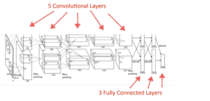
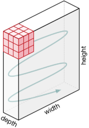
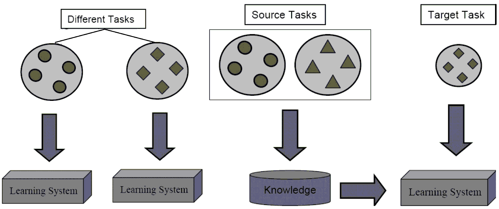
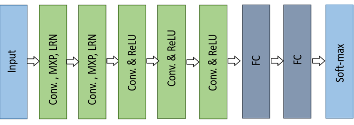

**Abstract**: The paper presents an introduction to CNN and later a
practical application of AlexNet and VGG11. The accuracy of these two
networks calculated on the classification of the images contained in the
Caltech-101 dataset will be analyzed. In particular, the work focuses on
some techniques to obtain better and more robust networks such as:

-   Transfer Learning.

-   Data Augmentation.

Some theoretical information regarding the techniques used is illustrated at the bottom.

Description of the project
==========================

In the project AlxeNet was trained on the Caltech-101 dataset, present
in this [GitHub
repository](https://github.com/MachineLearning2020/Homework2-Caltech101/tree/master/101_ObjectCategories).
The following aspects were analyzed:

-   Variations of the accuracy of the network with η and
    *step_size* changes.

-   Variations of the accuracy of the network with $\eta$ and
    $step\_size$ changes with the pre-trailed network on the dataset
    [ImageNet](http://www.image-net.org/).

-   Study on the effects of the application of Data Augmentation.

Code Overview
-------------

Caltech-101 is a dataset containing 102 classes of different images, 101
of these represent real objects while the last represents only
backgrounds. For this reason it was necessary to create a class, which
inherits from *VisionDataset*, which during the loading of the dataset
excluded the background category. This class, called Caltech, is present
in the *Utility* cell. The following methods are also present in this
cell:

-   *prepareDataloader*: it is used to create the dataloaders to scroll
    through the various sets (train, validation, test and train +
    validation) during the training and calculation phases of accuracy.
    The first point of the homework (*Data Preparation*) is entirely
    developed by this method.

    The method has as input an object of the *transform* type that
    modifies the images normalizing and resizing them in the first
    phases, while in the case of Data Augmentation it allows to apply
    the various transformations.

-   *stoppingCriteria*: it defines a criterion to stop the training of
    the network before the maximum number of epochs is reached. It
    allows therefore to have faster trainings in the cases in which the
    accuracy of the network is constant or is decreasing.

-   *partialTrain*: it trains the net on the union of train and
    validation by freezing the convolutional or the FC layers and using
    as hyperparameters those passed in input. The choice of which part
    of the network to freeze also depends on the input. Once the network
    has been trained, the accuracy of the test set is calculated.

-   *tuneHyperparameters*: it is the method in which various
    hyperparameters are tested. Inside it contains a cycle in which the
    network is trained with the various combinations of
    ($\eta, \> step\_size$). For each epoch the accuracy on the
    validation is calculated and, once the major one is determined, the
    network is retrained on the union of the train and the validation
    and its accuracy on the test set is calculated. This last training
    phase is carried out using the set of hyperparameters
    ($\eta, \> step\_size, \> num\_epoch $) which gave the best accuracy
    in the previous phase. It is noteworthy that the number of epochs
    with which the network is trained the second time is not necessarily
    the maximum number of epochs defined but it is the one for which the
    best accuracy was obtained. In the case in which the loss value,
    calculated in the training phase, is *NaN* this phase is interrupted
    and the pair of hyperparameters is discarded.

    The method has a network as input and the necessary dataloaders to
    scroll through the various sets, in this way it can be used both in
    the initial phase, where the network is trained from scratch, and in
    the subsequent phases, in which Learning Transfer is carried out.

[H]\
\
  \
\
 \
  \
 [train]

Since AlexNet was designed to classify 1000 images while the dataset
used has only 101 all the methods in which the network is trained modify
the number of outputs of the last FC level by setting it to 101.

The couple of hyperparameters ($\eta, \> step\_size$) tested are showed
in table [t1] and they are present in the code inside the *Set Argument*
cell. The values for these hyperparameters have been chosen so that the
high $\eta$ fall rapidly, while the low ones vary very slowly.

[H]

  -------- --------------
   $\eta$   $step\_size$
    0.1          20
    0.01         30
    0.01         45
   0.001         60
  -------- --------------

[t1]

*Set Argument* cell also contains the remaining parameters to train the
network as:

-   *NUM$\_$EPOCH*: is the maximum number of epochs for which the
    network is trained, it is set to $200$.

-   *BATCH$\_$SIZE*: is the dimension of each batch, it is set to $256$
    for AlexNet while for VGG11 it is set to $32$.

-   *MOMENTUM, WEIGHT$\_$DECAY, GAMMA*: are parameters necessary for the
    calculation of the SGD algorithm, their values are
    ($0.9, 5 * 10 ^ {- 5}, 0.1$), as mentioned above.

-   *HP, strip$\_$len*: are parameters necessary for the calculation of
    the early stop algorithm, they represent the maximum number of
    consecutively controlled strips and the length of each strip. Both
    are set to 5.

-   *train, TL, data$\_$augmetation($\_1/\_2/\_3$) transform*: are the
    objects that will be passed to the *prepareDataloader* method. All
    carry out the transformations necessary to bring the dimensions of
    the images from those original to those permitted by the network.
    Since TL$\_$transform and data$\_$augmetation$\_$transforms are used
    to generate dataloaders that will scroll through images for
    pre-trained networks, these transforms normalize images with
    different values than train$\_$transform. Furthermore
    data$\_$augmentation$\_$transform is used for realize data
    augmantation so it also implements a set of transformations.

Training from scratch
---------------------

After creating both the dataloaders, using the PrepDataloader method to
which train$\_$trasform has been passed, and the untrained network,
which is provided by Pytorch in both version trained and untrained, the
*tuneHyperparamameters* method is executed and its whose results are
shown below.

For the couple of hyperparameters ($\eta = 0.1, \>step\_size  = 20$) the
best accuracy (16.25) is reached at the epoch 6. The train is stopped to
the epoch 8 because the value of the loss is $NaN$, this happen because
the high value of $\eta$ make diverge the loss.

For the second couple of hyperparameters
($\eta = 0.01, \>step\_size  = 30$) the best accuracy (47.61) is reached
at the epoch 92. The lowest $\eta$ does not lead to the divergence of
the loss allowing the network to train for longer. The training phase
ends at the iteration 185 due to the stop criterion. In the last 100
epochs it is not possible to notice big changes in the accuracy
calculated on the validation because, due to the very low $step\-size$,
the weights of the net are updated of very small quantities. The early
stop criterion does not stop the training phase beforehand as the
accuracy continues to improve slightly, until the last 25 epochs.

For the third pair of hyperparameters
($ \eta = 0.01,> step\ _size = 45 $) the best accuracy is (53.63) is
reached at the epoch 90. Having a higher step size $\eta$ increases more
slowly allowing more significant weight changes. As in the previous case
it is possible to find how the accuracy remains more or less unchanged
once $\eta$ assumes a value of $10^{-4}$.

For the fourth pair of hyperparameters
($ \eta = 0.0o1,> step\ _size = 60 $) the best accuracy is (9.19) is
reached at the epoch 3. After which the accuracy remains constant for
the next 25 epochs and the early stop criterion stops the training.

The best value obtained for accuracy was that of the third pair of
hyperparaeters, therefore the network was retrained with these values
for 90 epochs on the union of the train and the validation. Later, the
accuracy of the 50.92 test set was calculated.

Transfer Learning
-----------------

Since Caltech-101 is a relatively small dataset on which to train a CNN,
it was decided to implement transfer learning as an attempt to improve
the accuracy of the network. The TL mode used was *Fine Tuning
Pre-trained Models* as in the entire pre-trained AlexNet it was trained
on Caltech-101. To do this, the data loaders were created using the
$TL\_transform$ transform object.

The results, obtained by executing *tuneHyperparamameters* are showed
below. As for the previous point, the pair of hyperparameters
($\eta = 0.1, \> step\_size = 20$) caused the loss on the train to
diverge within the first epochs, thus interrupting the training of the
network. On the other hand the other hyperparameter pairs have obtained
significantly higher accuracy than the previous case. The results in
detail are shown in tables [t2]

[H]

c|c|c|c $\eta, $ & Max Acc and & Epoch of\
$ step\_size$&Epoch&exit\
&&\
($0.01,\> 30$) & ($86.30\%$, 52) & 120\
($0.01,\> 45$) & ($87.21\%$, 90) & 115\
($0.001,\> 60$) & ($85.13\%$, 113) & 180\

[t2]

As expected, the pre-trained model is able to recognize the general
features of the image, obtaining from the first iterations a highest
accuracy with respect to all epochs of previous point. Accuracy
continues to improve in later epochs when the model learns the
high-level features of the images contained in Caltech-101.

The result of the trained network, both on the train and on the
validation, with the hyper-parameters (0.01, 45) is 85.00$\%$.

Subsequently the network was retrained two more times, using the best
pair of hyper-parameters obtained in the previous step, freezing in the
first training the convolutional layers and in the second the fully
connected layers. The accuracy calculated on the test in the two cases
is very different, in the first case in fact the network reaches a value
of $88.52\%$, while in the second case only $72.42\%$.

These phase of trainig took much less time than the previous ones, this
is due to the fact that, freezing half of the levels, the update phase
concerns fewer parameters, and is therefore faster.

Data Augmentation
-----------------

To further increase the volume of the datasets some Data Augmentation
techniques have been applied.

The objects $data\_augmentation\_trasform$ include within themselves the
following transformations:

-   *RandomCrop*: Crop the given PIL Image at a random location.

-   *RandomHorizontalFlip*: Horizontally flip the given PIL Image
    randomly with $50\%$ probability.

-   *Grayscale*: Convert image to grayscale. The number of the channels
    of the output image is set to 3.

-   *RandomVerticalFlip*: Vertically flip the given PIL Image randomly
    with $50\%$ probability.

-   *RandomRotation*: Rotate the image by angle between -90 and 90
    degrees.

-   *ColorJitter*: Randomly change the brightness, contrast and
    saturation of an image.

The following combinations of transfomrations have been tested:

-   RandomCrop, Grayscale, RandomHorizontalFlip.

-   Grayscale, RandomCrop, RandomVerticalFlip.

-   RandomCrop, RandomHorizontalFlip, ColorJitter.

For each combination of transformations the *tuneHyperparameters* method
was performed . The best triad of transformations is: *RandomCrop,
RandomHorizontalFlip, ColorJitterwith*. This set of transformations
allows the network to reach an maximum accuracy of $74.59\%$ on the test
set. The other two sets of transformations only reach the $72.21\%$ and
the $68.89\%$ of accuracy.

While before there was a strong similarity between the images of the
train and the test set now there is no more, this leads to a general
decrease in network performance compared to when only transfer learning
was implemented. However, techniques such as Data Augmentation allow the
network to commit overfitting in more advanced stages of training,
making the network able to better classify data that is different from
the train set.

Beyond AlexNet 
---------------

To further study the behavior of CNN some of the previous experiments
have been conducted on VGG11. VGG is a CNN architecture trained by
Oxford’s [Visual Geometry Group](http://www.robots.ox.ac.uk/~vgg/).
VGG11 is the smallest model of the VGG architecture implemented by
Pytorch.

VGG’s architecture instead of using large filter sizes with large
strides, such as in AlexNet, uses small (3x3) filter sizes with stride 1
throughout the whole net. Moreover all the inputs to ConvLayers are
appropriately padded such that after the convolution step the spatial
dimension of the output is same as the input.

Only the pooling layers are responsible for changing the spatial
dimensions. All max-pooling layers use a (2x2) filter with stride 2.
This results in the reduction of spatial dimensions by a factor of 2. A
ReLU layer is applied to every output of the ConvLayers and the FC
layers.

 [alex]

A stack of two (3x3) ConvLayers has an effective receptive field of one
(5x5) ConvLayer; and three such ConvLayers have an effective receptive
field of one (7x7) ConvLayer As a result, by using multiple small filter
we are not loosing any information, in terms of receptive field area.

Comparison between three (3x3) Conv Layers and a (7x7) Conv Layer.

-   Both have the same receptive field.

-   As each ConvLayer is associated with a ReLU layer if more than one
    small filter is used, a greater non-linearity is introduced in the
    network. This makes the decision function more dicriminative and
    hence learn more complex features. This also allows the model to
    create a better mapping from the images to the labels.

-   The number of parameters decrease using the stack of (3x3)
    ConvLayers. Assuming both the input and output have C channels, the
    stack of (3x3) is parametrised by 3×(3²C²) = 27C² weights whereas
    the (7x7) will require 1×(7²C²) = 49C² weights. Using (3x3)
    ConvLayers decreases the size of the model on memory and also acts
    as a sort of regularisation, making the network less prone to
    overfitting.

So using multiple layers with small filters is more advantageous than
using fewer ones with larger filters if a layer with an activation
function is added to each convolutional layer.

As VGG11 is deeper than AlexNet, the Batch size has been reduced from
256 to 64. This leads to more weight updates by age and more training
time.

Generally VGG11 performs better than AlexNet in all the tests involved,
except those in which the combination of hyperparameters
($\eta = 0.1, step\_size = 20$) has been used. This pair of
hyperparameters leads even VGG11 to have a loss equal to NaN. The
results of the various experiments are shown in Table [t3]. Noteworthy
is the accuracy obtained by the pretrained network with the pair of
hyperparameters ($\eta = 0.001, step\_size = 60$), $90.7\%$ in fact it
is the best result obtained on the test in all the experiments
performed.

[H]

  -------------- ----------------------------- -------------
       Test              Hyperamenters           Accuracy
    Performed     ($\eta, step\_size, epoch$)   on test set
                                               
     Trained                                   
       from             (0.01, 30, 55)           $52.3\%$
     scratch                                   
                                               
        TL             (0.001, 60, 147)          $90.7\%$
                                               
       Data            (0.001, 60, 101)          $86.76\%$
   Augmentation                                
  -------------- ----------------------------- -------------

[t3]

To do Data Augmentation all three combinations of transformations are
used. The higher accuracy obtained from Data Augmentation is present in
Table [t3] and it is calculated with the last combination of
transformations.

Convolutional Neural Network
============================

A Convolutional neural network (CNN) is a deep neural network that has
one or more convolutional layers and it is used mainly for image
processing, classification, segmentation and also for other auto
correlated data.\
CNNs have two components:

-   **Feature extraction part**: in this part, the network will perform
    a series of convolutions and pooling operations during which the
    features are detected.

-   **The Classification part:** here, the fully connected layers will
    serve as a classifier on top of these extracted features. They will
    assign a probability for the object on the image.

Convolutional networks were inspired by biological processes in that the
connectivity pattern between neurons resembles the organization of the
animal visual cortex. Individual neurons respond to stimuli only in a
restricted region of the visual field known as the receptive field. The
receptive fields of different neurons partially overlap such that they
cover the entire visual field@wikiintro. Therefore the network, rather
than looking at an entire image at once to find certain features,
divides the image in smaller portions from which it extracts the
features. To do this, operations called convulsions are performed, a
convolution is essentially sliding a filter over the input.

A CNN typically consists of 4 types of layers:

-   Convolution Layer

-   Pooling Layer

-   Activation Function Layer

-   Fully Connected Layer

Convolution Layer
-----------------

The convolutional layer is the core building block of a CNN and it is
always the first layer. The aim of this layer it is to extract the
features from the input image that it is represented by *depth x height
x width* array of pixel values where the dimension depending on the
resolution and size of the image. Conventionally, the first ConvLayer is
responsible for capturing the Low-Level features such as edges, color,
gradient orientation, etc. With added layers, the architecture adapts to
the High-Level features as well.\

In the context of a convolutional neural network, a convolution is a
linear operation that involves the multiplication of a set of weights,
called a filter or a kernel, with the input. The filter, that has a
smaller height and width than the input data but has the same depth, is
applied through calculation of the dot product between a filter-sized
patch of the input and itself. The Bias term is added to the result of
this product.

$$f(x,W) = W \cdot x + bias$$

Using a filter smaller than the input is intentional as it allows the
same filter to be multiplied by the input array many times at different
points on the input. Specifically, the filter is applied systematically
to each overlapping part or filter-sized patch of the input data, left
to right, top to bottom.

This systematic application of the same filter across an image is a
powerful idea. If the filter is designed to detect a specific type of
feature in the input, then the application of that filter systematically
across the entire input image allows the filter an opportunity to
discover that feature anywhere in the image. This capability is commonly
referred to as *translation invariance*.\
As the filter is applied multiple times to the input array, the result
is a two-dimensional array of output values that represent a filtering
of the input. As such, the two-dimensional output array from this
operation is called a *feature map*.

The dimensions of the feature map will be:

-   H~out~ = + 1

-   W~out~ = + 1

-   D~out~ = number of filters apply on the convolutional layer.

Where the subscript *in* represents the dimensions of the input image,
the subscript *K* represents the dimensions of the filter and *S*
represents the stride: the number of positions to which the filter is
moved between one application and another.

Because the size of the feature map is always smaller than the input,
something must be done to prevent our feature map from too shrinking. A
layer of zero-value pixels is added to surround the input with zeros, so
that our feature map will not shrink. In addition to keeping the spatial
size constant after performing convolution, padding also improves
performance and makes sure the kernel and stride size will fit in the
input. If padding is applied the size of the padding used must be added
two times to the input size in the output size calculation.

Pooling Layer
-------------

After a convolution layer, it is common to add a pooling layer between
CNN layers. The pooling layer operates over each activation map
independently and its function is to continuously reduce the
dimensionality to reduce the number of parameters and computation in the
network. This shortens the training time and controls overfitting. The
pooling operation provides another form of translation invariance.

The most frequent type of pooling is max pooling, which partitions the
input image into a set of rectangles and, for each sub-region, outputs
the maximum. These sub-region sizes need to be specified beforehand.

This decreases the feature map size without introduce parameters while
at the same time keeping the significant information.

Other pooling layer functions can be:

-   Average pooling.

-   L~2~-norm pooling.

-   Rol-pooling.

The dimension of the outputs can be calculated with the formulas of the
ConvLayer except for the depth, which does not change.

Activation Function Layer
-------------------------

The activation function decides whether to activate the components of
the output of the previous level. The purpose of this level is to
introduce non-linearity in the network. An important feature of a
activation function is that it should be differentiable. We need it to
be this way so as to perform backpropogation optimization strategy while
propogating backwards in the network to compute gradients of error(loss)
with respect to Weights and then accordingly optimize weights using
gradient descend or any other Optimization technique to reduce error.

The most used activation function is *ReLU*:

$$R(x) = \max(0,x)$$

One of the greatest advantage ReLU has over other activation functions
is that it does not activate all neurons at the same time and it is less
computationally expensive than *tanh* and *sigmoid* because it involves
simpler mathematical operations. ReLU does not saturate at the positive
region but it is saturated at the negative region, meaning that the
gradient at that region is zero. With the gradient equal to zero, during
backpropagation all the weights will not be updated. To fix this, it can
be used *Leaky ReLU*, which is similar to the ReLU with the only
difference that in the negative region, instead of setting the value to
zero ($x$), it sets it to $ \alpha \cdot x $. Also, ReLU functions are
not zero-centered. This means that for it to get to its optimal point,
it will have to use a zig-zag path which may be longer.

Fully Connected Layer
---------------------

Finally, after several convolutions and max pooling, the high-level
reasoning in the neural network is done via fully connected (FC) layers.
The objective of a FC layer is to take the results of the
convolution/pooling process and use them to classify the image into a
label, in a classification example.\
\
Neurons in a FC layer have connections to all activations in the
previous layer, as seen in regular (non-convolutional) artificial neural
networks. Their activations can thus be computed with matrix
multiplication followed by a bias offset. To do that the output of
convolution/pooling is flattened into a single vector of values.

Training CNN
============

The overall training process of the Convolution Network may be
summarized in the algorithm [train].

 \
\
     [train]

Where *step\_size* indicates after how many epochs $\eta$ is decreased
by a $\gamma$ factor, which has been set to 0.1 during the experiment.

**Forward Pass:** the image is passed over the network, the ConvLayer
and Pooling layers act as feature extractors while FC layer acts as a
classifier.

**Calculates the Loss:** once the network has determined the class of
the input image the Loss is calculated. In the experiment carried out a
particular Loss called *CrossEntropyLoss* is used which is expressed
with:

$$loss(x,class)=  \left ( \log_{}{\frac{exp(x[class])}{\sum_j exp(x[j])}} \right) ^ {(-1)}$$

**Backward Pass:** the backpropagation is applied, which computes the
gradient of the loss function with respect to the weights of the network
for a single input-output image by the chain rule. This makes it
feasible to use gradient methods for training multi-layer networks and
updating weights and biases to minimize loss. Commonly one uses gradient
descent or variants such as stochastic gradient descent (SGD). A variant
of the latter was used to conduct the experimentation.

Stocastic Gradient Descent + Momentum
-------------------------------------

Stochastic gradient descent is an optimization algorithm that estimates
the error gradient for the current state of the model then updates the
weights of the model using the back-propagation of errors algorithm. The
amount that the weights are updated during training is referred to as
the learning rate ($\eta$).

$$w_{t+1} = w_t - \eta\nabla L(w_t)$$

Specifically, $\eta$ is a configurable hyperparameter used in the
training of neural networks that has a small positive value, often in
the range between 0.0 and 1.0.

The learning rate controls how quickly the model is adapted to the
problem. Smaller learning rates require more training epochs given the
smaller changes made to the weights each update, whereas larger learning
rates result in rapid changes and require fewer training epochs. A
learning rate that is too large can cause the model to converge too
quickly to a suboptimal solution, whereas a learning rate that is too
small can cause the process to get stuck. $\eta$ may be the most
important hyperparameter for the model.

SGD presents some problems if there are local minimums or saddles. For
this reason the version of SGD + Momentum has been used. It allows us to
better escape from these points, converging more quickly to a global
solution. To do this the weights are updated differently:

$$v_{t+1} =\rho_t + \nabla L(w_t)$$

$$w_{t+1} = w_t - \eta v_{t+1}$$

In the experiment rho value was set to 0.9.

Transfer Learning (TL)
======================

Transfer learning is a machine learning method where a model developed
for a task is reused as the starting point for a model on a second task.
So TL is a research problem that focuses on storing knowledge gained
while solving one problem and applying it to a different but related
one. Transfer learning is an optimization that allows rapid progress or
improved performance when modeling the second task. Another motivation
to use TL is that, especially considering the context of deep learning,
most models which solve complex problems need a whole lot of data, and
getting vast amounts of labeled data for supervised models can be really
difficult. Through the use of TL it is possible to recover the knowledge
from data that do not belong at the task that it has to be performed and
obtain good result also begin from a small amount of data.

 [alex]

The two most popular strategies for deep transfer learning are:

-   **Pre-trained Models as Feature Extractors**: Deep learning models
    are layered architectures that learn different features at different
    layers (ConvLayer). These layers are then finally connected to a
    last layer (usually a fully connected layer, in the case of
    supervised learning) to get the final output. This layered
    architecture allows to utilize a pre-trained network without its
    final layer as a fixed feature extractor for other tasks.

    For instance, if AlexNet is used without its final classification
    layer, it will help transform images from a new domain task into a
    4096-dimensional vector based on its hidden states, thus enabling to
    extract features from a new domain task, utilizing the knowledge
    from a source-domain task.

-   **Fine Tuning Pre-trained Models**: This is a more involved
    technique, where it is done not just replace the final layer (for
    classification/regression), but also it is retrained some of the
    previous layers. Deep neural networks are highly configurable
    architectures with various hyperparameters. As discussed earlier,
    the initial layers have been seen to capture generic features, while
    the later ones focus more on the specific task at hand

    Using this insight, certain layers may be freezed while retraining,
    or fine-tune the rest of them to suit needs. In this case, knowledge
    is utilized the in terms of the overall architecture of the network
    and use its states as the starting point for retraining step. This
    helps achieve better performance with less training time.

Freezed Layers
--------------

Freezing a layer prevents its weights from being modified. This
technique is often used in transfer learning, where the base model is
frozen. If some layer are frozen, the backward pass to that layer can be
completely avoided, resulting in a significant speed boost. On the other
hand, you still need to train the model, so if you freeze it too early,
it will give inaccurate predictions. This technique is to cut down on
the computational time for training while losing not much on the
accuracy side.

Data Augmentation
=================

Data Augmentation is a technique that allows to solve some problems
related to the lack of a sufficient amount of data. In particular Data
Augmentation is based on the modification of the input images of the
model, this is possible since a CNN is able to classify an object even
if it is placed in different orientations. This property is called
invariance. More specifically, a CNN can be invariant to translation,
viewpoint, size or illumination, or a combination of the these.

Data Augmentation is done before the images are given to the CNN, this
it can be done in two different ways: one option is to perform all the
necessary transformations beforehand, essentially increasing the size of
your dataset. The other option is to perform these transformations on a
mini-batch, just before feeding it to your machine learning model.

The first option is known as **offline augmentation**. This method is
preferred for relatively smaller datasets, since the size of the dataset
will increase by a factor equal to the number of transformations
performed.

The second option is known as **online augmentation**, or augmentation
on the fly. This method is preferred for larger data sets, since the
explosive size increase cannot be allowed. This procedure was used in
the experiment.

Data Augmentation cannot overcome all biases present in a small dataset.
For example, in a traffic signs classification task, if there are only
signs of obligation and no case of stop signals, no augmentation method
will create a stop signals. However, several forms of biases such as
lighting, occlusion, scale, background, and many more are preventable or
at least dramatically lessened with Data Augmentation. Overfitting is
generally not as much of an issue with access to big data. Data
Augmentation prevents overfitting by modifying limited datasets to
possess the characteristics of big data.

The most common transformations are:

-   *Flip*: it is possible flip imagines horizontally or vertically.

-   *Rotation*: one key thing to note about this operation is that image
    dimensions may not be preserved after rotation

-   *Scale*: the image can be scaled outward or inward.

-   *Random Cropping*: it just randomly sample a section from the
    original image and then resize this section to the original size.

Early Stopping
==============

In machine learning, early stopping is a form of regularization used to
avoid overfitting when training a model with an iterative method, such
as gradient descent. Such methods update the model so as to make it
better fit the training data with each iteration. Therefore if the model
is trained too little it will commit underfitting on the train and the
test sets. Whereas if it trained too much it will commit overfitting on
the training set and have poor performance on the test set.

The challenge is to train the network long enough that it is capable of
learning the mapping from inputs to outputs, but not training the model
so long that it overfits the training data. A compromise is to train on
the training set but to stop training at the point when performance on a
validation set starts to degrade.

To understand when the performance of the model on the validation set is
decreasing due to overfitting, various techniques have been studied,
explained in @early_stop. In particular, in the experiment, referring to
the terminology of the article mentioned above, an early stop criterion
of the UP type with parameters $(K = 5, \>S = 5)$ was developed.

AlexNet
=======

AlexNet, which is the network used for experiments, competed in the
ImageNet Large Scale Visual Recognition Challenge on September 30, 2012.
The network achieved a top-5 error of 15.3$\%$, more than 10.8
percentage points lower than that of the runner up.

The input to AlexNet is an RGB image of size 224x224. This means all
images used need to be of size 224x224. If the input image does not has
these dimensions, it needs to be converted to 224x224 before using it
for training the network.

 [alex]

The figure [alex] represents the architecture of the network, the list
of parameters of the various levels is in this [GitHub
repository](https://github.com/pytorch/vision/blob/master/torchvision/models/alexnet.py).
